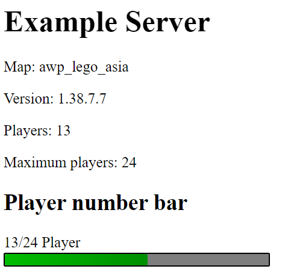

# Steam web API CS:GO server example

Here is a tutorial on how to use Steam's server API to display server data on your website. This example demonstrates the correct usage of the Steam web API to retrieve data from a CS:GO server in PHP and display information such as the number of players, current map, number of slots on the server, region, and more.

For more detailed documentation about the Steam server API, please refer to the official Steam documentation or developer resources. This will provide you with a comprehensive understanding of the available endpoints, parameters, and data that can be accessed through the API.

  

More documentation about the Steam server API:

<ul>
  <li><a href="https://partner.steamgames.com/doc/webapi_overview">Steamworks</a></li>
  <li><a href="https://developer.valvesoftware.com/wiki/Counter-Strike:_Global_Offensive/Dedicated_Servers">Valve Developer Community</a></li>
  <li><a href="https://steamcommunity.com/dev?snr=">Steam Community</a></li>
  <li><a href="https://steamwebapi.azurewebsites.net">Azure Website</a></li>
</ul>

# Installation
<ol>
  <li>Clone the repository to your local machine and unzip the files</li>
  <li>Copy the files to your web server or to your local webserver (Make sure you have PHP installed on your system)</li>
  <li>Fill out the config.php file with your Steam API key and the IP address & port to your CS:GO server</li>
</ol>

# Preview

